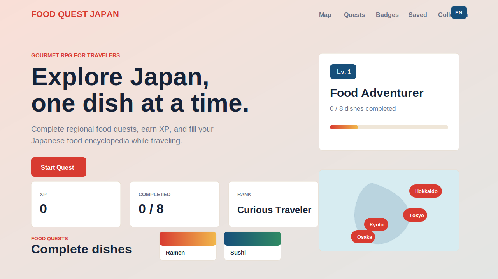

# FOOD QUEST JAPAN

Explore Japanese food through a gamified map-based quest.

FOOD QUEST JAPAN is a portfolio web app concept for travelers who want to discover Japanese food in a fun, RPG-like way. Users can browse regional food quests, save dishes they want to try, complete quests, earn XP, unlock badges, and fill a Japanese food encyclopedia.

## Live Demo

GitHub Pages URL:

```txt
https://n07shibasaki-sys.github.io/food-quest-japan/
```

## Concept

This app combines travel, food discovery, and game progression.

The target user is an international traveler visiting Japan who wants to answer questions like:

- What local food should I try in this region?
- What dishes have I already eaten?
- What food do I want to save for later?
- How can I make eating local food feel more like an adventure?

## Features

- Region-based food quest map
- Food quest cards with XP, difficulty, allergy notes, and travel tips
- 14 Japanese food quests across Tokyo, Osaka, Kyoto, Fukuoka, Hokkaido, Nagoya, Okinawa, Hiroshima, and Sendai
- Search by dish name, region, type, or keyword
- Type filter for noodles, seafood, street food, dessert, and vegetarian dishes
- Food detail modal with ordering phrase and travel-friendly information
- Complete Quest button that updates XP, rank, progress, and encyclopedia status
- Favorite feature
- Achievement badge system
- Food encyclopedia with locked and unlocked dish states
- English / Japanese language switch
- Progress saved with localStorage
- Responsive layout for desktop and mobile

## Tech Stack

- HTML
- CSS
- JavaScript
- localStorage

No backend is required for the current MVP. The app runs as a static website.

## Current Screens

- Hero / player status
- Quest Map
- Food Quests
- Quest Badges
- Favorite
- Food Encyclopedia
- Food Detail Modal
- Mobile bottom navigation

## Screenshot



## Project Structure

```txt
food-quest-japan/
  index.html
  map.html
  quests.html
  badges.html
  favorite.html
  collection.html
  README.md
  css/
    style.css
  js/
    data.js
    app.js
  images/
```

## Highlights

- Built as a static multi-page MVP that still shares progress through localStorage.
- Separates food quest data into `js/data.js` and app behavior into `js/app.js`.
- Uses JavaScript data objects to manage dishes, badges, progress, favorite items, and translations.
- Saves user progress in the browser using localStorage.
- Designed around a clear portfolio concept: "Gourmet x RPG".
- Includes multilingual UI to match the international traveler use case.
- Uses a multi-page static structure while sharing the same browser progress across pages.

## How to Use

Open `index.html` in a browser.

Then try:

1. Choose a region from the map.
2. Search or filter food quests.
3. Open a dish detail.
4. Add a dish to Favorite.
5. Complete quests to earn XP.
6. Unlock badges and fill the encyclopedia.
7. Switch between EN and JP.

## GitHub Pages Deployment

This project is ready to publish as a static website with GitHub Pages.

### Steps

1. Create a GitHub repository.
2. Upload or push these files to the repository:
   - `index.html`
   - `map.html`
   - `quests.html`
   - `badges.html`
   - `favorite.html`
   - `collection.html`
   - `README.md`
   - `.nojekyll`
   - `css/style.css`
   - `js/data.js`
   - `js/app.js`
   - `images/screenshot-home.svg`
3. Open the repository on GitHub.
4. Go to `Settings`.
5. Open `Pages`.
6. Under `Build and deployment`, choose:
   - Source: `Deploy from a branch`
   - Branch: `main`
   - Folder: `/root`
7. Click `Save`.
8. Wait until GitHub shows the published URL.
9. Replace the placeholder URL in the `Live Demo` section with your actual GitHub Pages URL.

### Notes

- The app uses relative paths, so it works correctly on GitHub Pages.
- No build step is required.
- No server or database is required for the current MVP.
- User progress is saved in the browser with localStorage.

## Future Improvements

- Add real food photos
- Add more regions and dishes
- Add Google Maps or another map API
- Add restaurant recommendations
- Add user login
- Save progress to a database
- Add route planning for favorite dishes
- Add allergy and dietary preference filters
- Deploy with GitHub Pages

## Portfolio Notes

This project focuses on UI design, interactive JavaScript, state management with localStorage, responsive layout, and product concept development.

It is designed to show how a travel-focused web app can turn food discovery into a playful quest experience.
